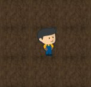
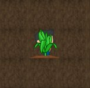

# La huerta de Toni - Game

## Etapa 1 - caminar, sembrar, regar y vender

### Intro
Toni es un [amigo youtuber](https://www.youtube.com/channel/UC8nVWi8L7fPCjOMpSSNAM0Q) que se gana la vida cultivando plantas de distintas especies.
Para ello tiene que sembrar, regar y cosechar sus cultivos. Después de la cosecha, Toni vende lo que cultivó, obteniendo ganancias en la forma de monedas de oro.
Toni es muy ahorrativo y todo el oro que obtiene por sus cosechas lo acumula.

Nuestro objetivo es construir un juego en el que podamos controlar a Toni, utilizando el teclado para moverlo alrededor del tablero. Las plantas y el comportamiento de Toni son los que ya agregamos en la primera etapa, aquí agregaremos algunas cosas para convertirlo en un juego.

Antes de empezar, copiá las definiciones de Toni, las plantas y la Pachamama en los archivos que dejamos ya preparados para ello.

### Caminar y sembrar

Configurar las siguientes teclas para controlar a Toni:

|Tecla|Acción esperada|
|-----|---------------|
|Flechas|Desplazan a Toni en la dirección correspondiente.|
|M|Siembra una planta de maíz en la posición actual.|
|T|Siembra una planta de trigo en la posición actual.|
|O|Siembra una planta de tomaco en la posición actual.|

Por ahora, vamos a evitar sembrar dos plantas en la misma celda, porque eso va a traer problemas a futuro. Más adelante vamos a agregar una validación para que Toni tire error. Es importante que Toni recuerde las plantas que sembró, lo vamos a necesitar para regar.

Al ser sembradas, las plantas aparecen en su estado inicial, según ya vimos en la etapa 1.

### Regar
Vamos a contemplar dos formas de regar:

|Tecla|Acción esperada|
|-----|---------------|
|A|Riega todas las plantas que hay en el tablero.|
|R|Riega la planta sobre la cual está parado Toni.|

El regar todas ya lo teníamos programado de la etapa anterior, no debería ser problemático. Regar una sola es más difícil: primero hay que averiguar qué plantas hay en la posición actual de Toni y luego regarlas.

Para esto, Wollok Game tiene un método llamado `colliders(visual)`, que devuelve **todos** los elementos que están chocando con el objeto que va por parámetro. Veamos dos ejemplos:

|Situación|Resultado de evaluar `game.colliders(toni)`
|--------|---------|
||`[]`|
||`[un/a Maiz]`|

Como se ve, lo que devuelve es una lista y lo que necesitamos es una sola planta, para poder regarla. Les queda a ustedes pensar cómo resolver eso.

El efecto de las plantas al ser regadas es el mismo de antes. Obviamente, tiene que actualizarse la imagen cada vez que se riega, en la carpeta `assets` ya tienen todo lo necesario.

### Cosechar
Nuevamente, vamos a contemplar dos formas de cosechar:

|Tecla|Acción esperada|
|-----|---------------|
|X|Cosecha todas las plantas que están **listas para cosechar**.|
|C|Cosecha la planta sobre la cual está parado Toni.|

En el caso de la cosecha por planta, por ahora vamos a ignorar si está lista o no.

### Vender
Programar las siguientes teclas:

|Tecla|Acción esperada|
|-----|---------------|
|V|Vende toda la cosecha actual.|
|Espacio|Informa el estado de Toni.|

Para el informe del estado de Toni vamos a armar un String y mostrarlo con `game.say`. El mensajito debería decir cuántas monedas tiene actualmente y cuántas plantas le quedan para vender, por ejemplo: `"Tengo 80 monedas y me quedan 3 plantas para vender"`.

Recordá que se pueden concatenar Strings utilizando el `+`:

```
>>> "Me quedan " + 3 + " plantas"
"Me quedan 3 plantas"
```

## Etapa 2 - la Pachamama

Vamos a simplificar aún más el manejo de la Pachamama, agregando solamente teclas para las acciones de fumigar y llover:

|Tecla|Acción esperada|
|-----|---------------|
|F|Provoca el cambio correspondiente a `fumigar` en la Pachamama.|
|L|Provoca el cambio correspondiente a `llover` en la Pachamama.|

Se pide además que cambie la imagen de la Pachamama cuando no está agradecida. La imagen para hacerlo no está incluida, tienen que armarla ustedes.

Debería cambiar también la imagen de los tomacos, para reflejar si están podridos o no. Estas imágenes sí se incluyen.

## Etapa 3 - validaciones

Agregar las siguientes validaciones:

1. Al sembrar, arrojar error si ya había otra planta en la celda actual.
1. Al cosechar, arrojar error si la planta de la celda actual no está lista.
1. Al cosechar, arrojar error si no hay ninguna planta en la celda actual.
